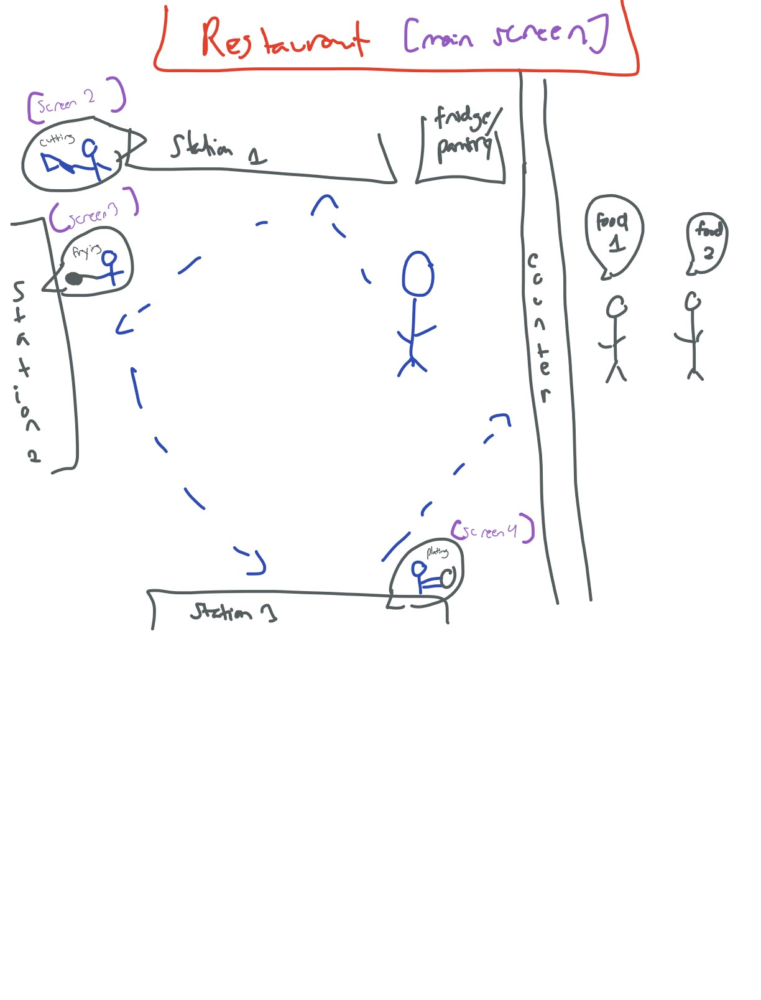

:warning: Everything between << >> needs to be replaced (remove << >> after replacing)

# << Project Title >>
## CS110 Final Project  Fall,2024

## Team Members

Monica Gnajewski

***

## Project Description

My project is a restaurant style game in which the player can move their character around to accept orders from incoming customers and complete tasks related to the orders. Moving to different stations within the kitchen setting will trigger new screens in which the player will be able to complete a task, such as frying a dish or chopping ingredients. 

***    

## GUI Design

### Initial Design

### Final Design

## Program Design
Classes
1. Player
- creates player character
- allows for user to move character up, down, left, and right using keyboard keys

2. Customer
- creates customer NPCS
- moves customer left to counter
- creates customer "order" (task completed by player)

### Features

1. moveable character
2. different screens
3. collectable items
4. background music
5. NPCs

### Classes

- << You should have a list of each of your classes with a description >>

## ATP

| Step                 |Procedure             |Expected Results                   |
|----------------------|:--------------------:|----------------------------------:|
|  1                   | Run Counter Program  |GUI window appears with count = 0  |
|  2                   | click count button   | display changes to count = 1      |
etc...
