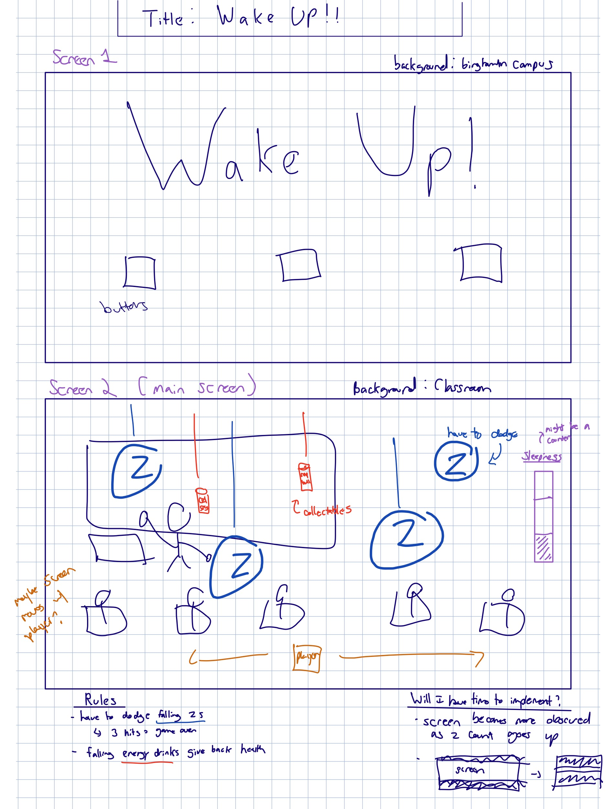
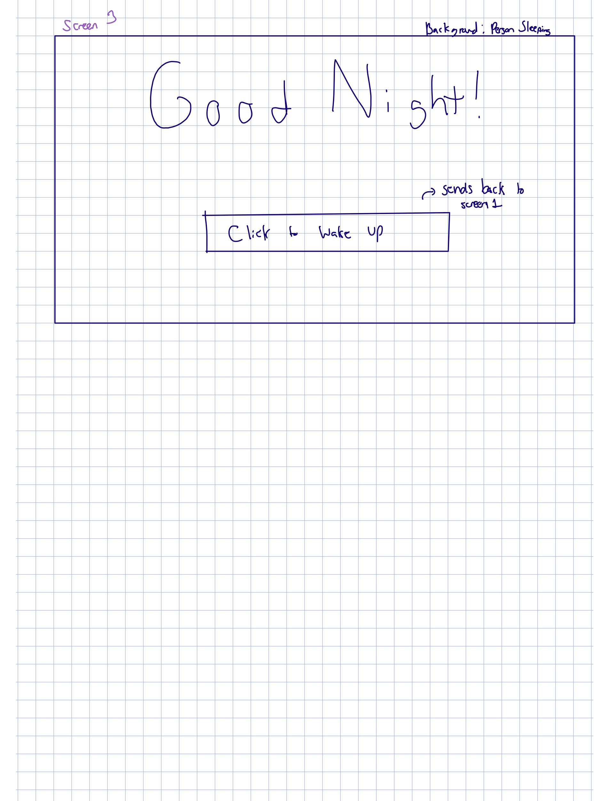
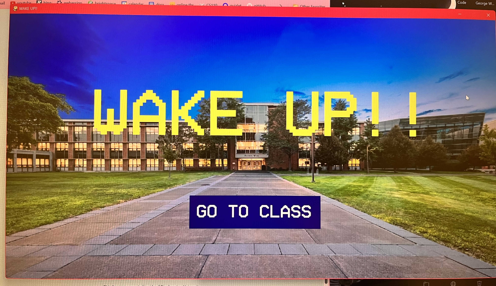
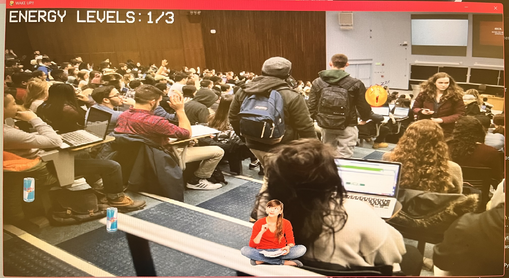

# WAKE UP!!
## CS110 Final Project  Fall, 2024

## Team Members

Monica Gnajewski

***

## Project Description

My game "WAKE UP!!" involves a college student struggling to stay awake during a lecture. The player must dodge the falling "z"s and collect Red Bulls to stay awake as long as possible. If they get hit by three "z"s, they fall asleep and the game ends with the professor yelling at them. Once the game ends, the player can wake up and try staying awake through the lecture again.

***    

## GUI Design

### Initial Design

### Final Design

## Program Design

### Features

1. moveable character
2. different screens
3. collectable items
4. falling obstacles
5. background music

### Classes

Classes
1. Player
- creates player character
- allows for user to move character up, down, left, and right using keyboard keys

2. Sleep
- creates falling obstacles
- respawns obstacles when they move offscreen

3. Drink
- creates falling collectables
- moves them downscreen

4. Button
- creates button
- highlights when mouse hovers over

## ATP

Test Case 1: Player Movement
Test Description: Verify that player is able to move the character left, right, up, and down using the arrow keys.
| Step                 |Procedure                                     |Expected Results                               |
|----------------------|:--------------------------------------------:|----------------------------------------------:|
|  1                   | Start the game.                              |GUI menu window appears with start button.     |
|  2                   | Press "Go to Class" button.                  |GUI game window appears, with player at bottom.|
|  3                   | Press right arrow key.                       |The player character moves right.              |
|  4                   | Press left arrow key.                        |The player charcter moves left.                |
|  5                   | Press up arrow key.                          |The player character moves up.                 |
|  6                   | Press down arrow key.                        |The player charcter moves down.                |

Test Case 2: Enemy Detection
Test Description: Verify that enemy dissappears and player life count is decreased when colliding with an enemy.
| Step                 |Procedure                                            |Expected Results                                       |
|----------------------|:---------------------------------------------------:|------------------------------------------------------:|
|  1                   | Start the game.                                     |GUI menu window appears with start button.             |
|  2                   | Press "Go to Class" button.                         |GUI game window appears, with player at bottom.        |
|  3                   | Move player charcter to collide with falling enemy. |Enemy dissappears and "Energy Levels" decreases by one.|

Test Case 3: Collectable Detection
Test Description: Verify that collectable dissappears and player life count is increased when colliding with a collectable.
| Step                 |Procedure                                            |Expected Results                                       |
|----------------------|:---------------------------------------------------:|------------------------------------------------------:|
|  1                   | Start the game.                                     |GUI menu window appears with start button.             |
|  2                   | Press "Go to Class" button.                         |GUI game window appears, with player at bottom.        |
|  3                   | Move player charcter to collide with falling drink. |Drink dissappears and "Energy Levels" increases by one.|

Test Case 4: Game Over
Test Description: Verify that gameplay ends when player loses their three lives.
| Step                 |Procedure                                              |Expected Results                          |
|----------------------|:-----------------------------------------------------:|-----------------------------------------:|
|  1                   | Start the game.                                       |GUI menu window appears with start button.|
|  2                   | Press "Go to Class" button.                           |GUI game window appears.                  |
|  3                   | Play until all three lives are lost.                  |GUI game over window appears.             |

Test Case 5: Restart
Test Description: Verify that button on the end screen restarts the game. 
| Step                 |Procedure                                              |Expected Results                          |
|----------------------|:-----------------------------------------------------:|-----------------------------------------:|
|  1                   | Start the game.                                       |GUI menu window appears with start button.|
|  2                   | Play until all three lives are lost.                  |GUI game over window appears.             |
|  3                   | Click the "Wake Back Up" button.                      |GUI menu window appears.                  |

